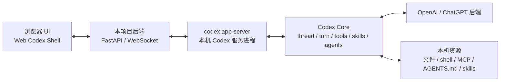

# Codex Web Shell TUI Parity Checklist

**日期：** 2026-05-11

## 目的

这个文档记录未来从 iTerm2 载体迁移到 **Web 版 Codex 壳** 时，需要长期对齐 Codex TUI 的能力清单。

核心目标不是重写 Codex Core，而是：

- 用浏览器 UI 替代 Codex TUI
- 用本项目后端连接 `codex app-server`
- 通过 `codex app-server` 继续使用 Codex Core、OpenAI / ChatGPT 后端、本机工具、MCP、skills、agents
- 在每次实现新能力时，明确说明当前 Web 壳距离 Codex TUI 还缺哪些能力

## 目标架构



## 非目标

- 不重写 Codex Core。
- 不直接让浏览器连接 OpenAI。
- 不直接让浏览器持有 Codex auth、shell、文件系统、MCP 等敏感能力。
- 不要求所有 Codex TUI 功能一开始都实现，但必须知道差距。

## POC 验证清单

POC 只验证路线是否成立，不追求完整 UI。

- [ ] 后端能启动或连接 `codex app-server --listen stdio://`。
- [ ] 后端完成 app-server `initialize`。
- [ ] 前端能创建一个 Codex thread。
- [ ] 前端能向 thread 发起 `turn/start`。
- [ ] 前端能实时显示 `item/started`、`item/agentMessage/delta`、`item/completed`、`turn/completed`。
- [ ] 前端能显示最小 statusline：模型、cwd、thread id、运行状态、token usage。
- [ ] 后端能调用 `skills/list` 并在前端展示。
- [ ] 后端能调用 `mcpServerStatus/list` 并在前端展示。
- [ ] 至少能观察到一次 agent/subagent 相关事件，或确认当前 Codex 版本暴露方式。
- [ ] 至少能处理一次 approval 请求，或确认当前权限配置不会触发 approval。

## Codex TUI 已承担的职责

下面是未来 Web 壳要长期对齐的终极清单。每一项都可以是：

- `Missing`：未实现
- `Partial`：部分实现
- `Parity`：基本对齐 Codex TUI
- `Omitted`：确认不需要，但必须说明原因

### 1. 会话与线程生命周期

- [ ] 新建 session / thread。
- [ ] 恢复历史 session。
- [ ] fork 当前 session。
- [ ] side conversation / 临时分支会话。
- [ ] archive / unarchive。
- [ ] rename thread。
- [ ] clear 当前 UI 并开启新会话。
- [ ] 显示 rollout 路径或等价调试信息。
- [ ] 多 session/thread 列表、筛选、搜索、状态展示。
- [ ] 处理 loaded / notLoaded / running / closed 等状态。

### 2. 输入框与消息提交

- [ ] 普通文本输入。
- [ ] 多行输入。
- [ ] 输入历史。
- [ ] 队列输入。
- [ ] turn 运行中追加 steer。
- [ ] interrupt 当前 turn。
- [ ] 粘贴文本处理。
- [ ] 本地图片输入。
- [ ] 远程图片输入。
- [ ] 文件 mention。
- [ ] app/plugin mention。
- [ ] 输入前校验 cwd、thread、权限状态。

### 3. Slash Commands

- [ ] `/new`
- [ ] `/resume`
- [ ] `/fork`
- [ ] `/clear`
- [ ] `/init`
- [ ] `/compact`
- [ ] `/review`
- [ ] `/rename`
- [ ] `/model`
- [ ] `/permissions`
- [ ] `/keymap`
- [ ] `/vim`
- [ ] `/setup-default-sandbox`
- [ ] `/sandbox-add-read-dir`
- [ ] `/experimental`
- [ ] `/approve`
- [ ] `/memories`
- [ ] `/skills`
- [ ] `/hooks`
- [ ] `/status`
- [ ] `/debug-config`
- [ ] `/title`
- [ ] `/statusline`
- [ ] `/theme`
- [ ] `/mcp`
- [ ] `/apps`
- [ ] `/plugins`
- [ ] `/logout`
- [ ] `/quit` / `/exit`
- [ ] `/feedback`
- [ ] `/rollout`
- [ ] `/ps`
- [ ] `/stop` / `/clean`
- [ ] `/copy`
- [ ] `/raw`
- [ ] `/diff`
- [ ] `/mention`
- [ ] `/plan`
- [ ] `/goal`
- [ ] `/collab`
- [ ] `/agent` / `/subagents`
- [ ] `/side`
- [ ] `/personality`
- [ ] `/realtime`
- [ ] `/settings`

### 4. Statusline 与标题状态

- [ ] 读取或配置 `[tui].status_line` 等价配置。
- [ ] 自定义 statusline 项目顺序。
- [ ] 显示模型名。
- [ ] 显示模型 + reasoning effort。
- [ ] 显示 cwd。
- [ ] 显示项目根目录。
- [ ] 显示 git branch。
- [ ] 显示 PR 号。
- [ ] 显示 branch change stats。
- [ ] 显示 run state：Ready / Working / Thinking / Waiting。
- [ ] 显示权限 profile。
- [ ] 显示 approval mode。
- [ ] 显示 context remaining。
- [ ] 显示 context used。
- [ ] 显示 5h rate limit。
- [ ] 显示 weekly rate limit。
- [ ] 显示 Codex version。
- [ ] 显示 context window size。
- [ ] 显示 used tokens。
- [ ] 显示 input tokens。
- [ ] 显示 output tokens。
- [ ] 显示 thread id。
- [ ] 显示 fast mode。
- [ ] 显示 raw output mode。
- [ ] 显示 thread title。
- [ ] 显示 task progress。
- [ ] 处理缺失数据时的隐藏/降级展示。

### 5. Transcript 与事件渲染

- [ ] 用户消息渲染。
- [ ] agent message delta 流式渲染。
- [ ] final agent message 合并。
- [ ] reasoning summary 渲染。
- [ ] command execution 渲染。
- [ ] command output delta 渲染。
- [ ] file change / patch 渲染。
- [ ] MCP tool call 渲染。
- [ ] dynamic tool call 渲染。
- [ ] web search 渲染。
- [ ] image view / image generation 渲染。
- [ ] context compaction 渲染。
- [ ] warning / error 渲染。
- [ ] hook event 渲染。
- [ ] collab agent tool call 渲染。
- [ ] plan update 渲染。
- [ ] todo / task progress 渲染。

### 6. Shell、文件修改与工具执行

- [ ] agent shell command 展示。
- [ ] 用户 `!` shell command 或 Web 等价入口。
- [ ] command stdout/stderr 实时输出。
- [ ] command exit code 展示。
- [ ] background terminals / processes 列表。
- [ ] 停止 background terminals。
- [ ] patch diff 展示。
- [ ] patch approval 展示。
- [ ] 文件变更成功/失败状态。
- [ ] 文件读写错误提示。

### 7. Approval、权限与 sandbox

- [ ] approval 请求弹窗。
- [ ] approve / deny。
- [ ] approval reason 展示。
- [ ] apply patch approval。
- [ ] command approval。
- [ ] MCP approval。
- [ ] ARC / network / sandbox escalation 展示。
- [ ] auto-review / guardian subagent approval 结果展示。
- [ ] 权限 profile 选择。
- [ ] sandbox mode 选择。
- [ ] network access 配置。
- [ ] danger-full-access 明确提示。

### 8. Skills

- [ ] `skills/list`。
- [ ] 按 cwd 查询 skills。
- [ ] force reload。
- [ ] `skills/changed` 监听。
- [ ] skill 详情展示。
- [ ] skill enable / disable。
- [ ] 显式 `$skill-name` 调用。
- [ ] turn/start 附带 skill input item。
- [ ] skill 不可用/路径缺失提示。

### 9. MCP

- [ ] MCP server 列表。
- [ ] MCP tool 列表。
- [ ] MCP auth 状态。
- [ ] MCP resources / resource templates。
- [ ] resource read。
- [ ] tool call 展示。
- [ ] OAuth login。
- [ ] MCP reload。
- [ ] MCP server 错误提示。

### 10. Agents / Subagents

- [ ] 展示 spawned agent。
- [ ] 展示 agent nickname。
- [ ] 展示 agent role。
- [ ] 展示 agent 状态：pending / running / interrupted / completed / errored / shutdown / notFound。
- [ ] 展示 spawn_agent tool call。
- [ ] 展示 send_input tool call。
- [ ] 展示 wait tool call。
- [ ] 展示 close_agent tool call。
- [ ] 支持切换 active agent thread。
- [ ] 支持恢复 closed agent。
- [ ] 支持关闭 agent。
- [ ] 支持 agent 结果通知。
- [ ] 明确区分 root thread 和 subagent thread。

### 11. Review 模式

- [ ] 启动 review。
- [ ] review branch picker。
- [ ] review commit picker。
- [ ] custom review prompt。
- [ ] review mode 状态展示。
- [ ] enteredReviewMode / exitedReviewMode 渲染。
- [ ] review final message 渲染。
- [ ] review 期间命令限制。

### 12. Plan、Goal、Collaboration Mode

- [ ] Plan mode 切换。
- [ ] collaboration mode 列表。
- [ ] collaboration mode 切换。
- [ ] goal set / get / clear。
- [ ] goal status 展示。
- [ ] token budget 展示。
- [ ] budget limited 状态。
- [ ] goal elapsed time。
- [ ] task progress 与 statusline 联动。

### 13. Memories、Compaction 与上下文管理

- [ ] 手动 compact。
- [ ] compact 进度展示。
- [ ] auto compact 相关提示。
- [ ] memories enable / disable。
- [ ] memory reset。
- [ ] memory mode per thread。
- [ ] context remaining / used。
- [ ] context window size。

### 14. 配置、模型与个性化

- [ ] `config/read`。
- [ ] `config/value/write`。
- [ ] `config/batchWrite`。
- [ ] model list。
- [ ] model picker。
- [ ] reasoning effort picker。
- [ ] service tier picker。
- [ ] personality picker。
- [ ] theme 设置。
- [ ] keymap 设置。
- [ ] vim mode。
- [ ] raw scrollback mode。
- [ ] terminal title 等价设置。
- [ ] experimental features 开关。

### 15. Auth、账号与限额

- [ ] account read。
- [ ] login start。
- [ ] login cancel。
- [ ] logout。
- [ ] ChatGPT managed auth。
- [ ] API key auth。
- [ ] account/rateLimits/read。
- [ ] account/rateLimits/updated。
- [ ] workspace credits / usage limit 状态。
- [ ] add credits nudge。
- [ ] auth 失效恢复。

### 16. Plugins、Apps 与 Connectors

- [ ] plugin list。
- [ ] plugin read。
- [ ] plugin install。
- [ ] plugin uninstall。
- [ ] plugin skill read。
- [ ] marketplace add/remove/upgrade。
- [ ] app list。
- [ ] app mention。
- [ ] connector auth 状态。
- [ ] remote plugin / local plugin 区分。

### 17. Realtime 与音频

- [ ] realtime start。
- [ ] realtime stop。
- [ ] append audio。
- [ ] append text。
- [ ] WebRTC / websocket transport 选择。
- [ ] 麦克风选择。
- [ ] 扬声器选择。
- [ ] realtime 状态展示。

### 18. 通知、错误与恢复

- [ ] warning notification。
- [ ] fatal error 展示。
- [ ] app-server 断开恢复。
- [ ] app-server overloaded 重试。
- [ ] turn failed 展示。
- [ ] thread closed 展示。
- [ ] skills changed invalidation。
- [ ] fs changed 展示。
- [ ] remote control status changed。
- [ ] 版本不匹配提示。
- [ ] experimental API 不支持时降级。

### 19. 调试、测试与反馈

- [ ] debug config 输出。
- [ ] status 输出。
- [ ] feedback upload。
- [ ] logs 收集。
- [ ] app-server stderr tail 展示。
- [ ] protocol schema 版本记录。
- [ ] 启动自检。
- [ ] POC smoke test。
- [ ] TUI parity gap report。

## 每次实现后的差距报告模板

未来实现 Web Codex 壳相关功能时，最终回复必须包含一段简短差距报告：

```text
Codex TUI parity:
- 本次已补齐：
- 仍然缺失：
- 已确认暂不做：
- 影响用户验收的差距：
```

如果只是 POC，也必须明确说：

```text
当前仍是 POC，不是 TUI parity 实现。
```

## 当前状态

截至 2026-05-11，本项目仍是 iTerm2 管理器，并未实现 Web Codex Shell。

因此，上述 TUI parity 清单默认全部视为 `Missing`，除非后续功能开发明确更新本文件或在实现说明中标记状态。
